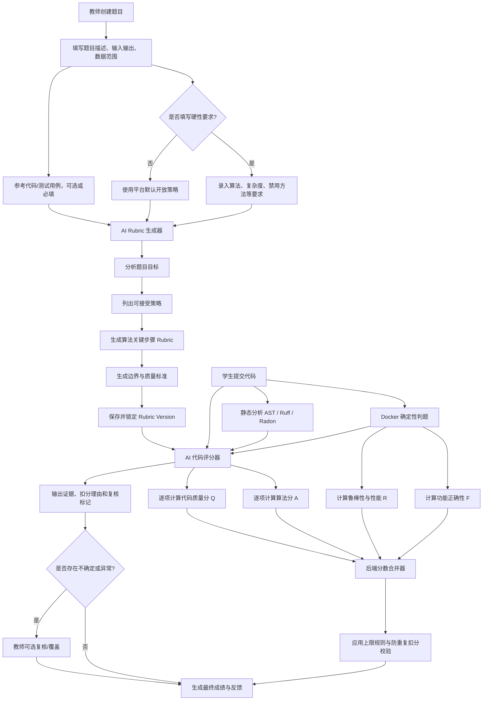

# DAI 实验平台智能代码评分方案 V1

> 文档状态：讨论稿 / V1 候选方案  
> 适用项目：`zxkk97984-creator/dai-experiment-platform`  
> 适用范围：以 Python 单函数题、基础语法题、数据结构题和常规算法题为主  
> 核心目标：在保留确定性测试公平性的基础上，引入 AI 对算法思路、关键步骤和代码质量进行结构化评分。

---

## 1. 方案背景

传统自动判题通常只判断学生代码是否通过测试用例。它容易出现以下问题：

1. 学生整体思路正确，但因为一个边界错误导致大量测试失败，最终分数过低；
2. 学生代码能够产生正确输出，但算法复杂度过高、结构混乱、重复计算严重，仍可能获得高分；
3. 教师需要为每道题人工编写非常详细的过程评分标准，维护成本较高；
4. 直接让 AI “凭感觉打总分”容易产生随机性、偏见和无法解释的扣分。

因此，本方案采用：

```text
确定性自动测试
+
AI 自动生成题目专属 Rubric
+
AI 按 Rubric 逐项评价
+
后端固定公式合并成绩
```

本方案**不判断代码是否由 AI 生成**，只评价学生实际提交的代码质量、算法完成情况和运行结果。

---

## 2. 核心原则

### 2.1 测试结果与 AI 评分相互独立

- 功能正确性和边界测试由确定性判题系统计算；
- 算法思路和代码质量由 AI 按已锁定 Rubric 评价；
- AI 不得修改测试结果；
- AI 不得直接决定最终总分；
- 最终总分由后端按照固定公式计算。

### 2.2 参考答案不是唯一答案

参考代码只用于帮助 AI 理解题目，不得作为代码相似度模板。

学生只要满足题目要求，就应允许：

- 不同变量名；
- 不同代码结构；
- 不同循环或递归写法；
- 不同但正确的算法；
- 不同的数据结构选择。

只有题目或教师硬性要求明确限制时，才能要求特定算法、复杂度、函数形式或数据结构。

### 2.3 教师硬性要求可选

教师可以选择填写：

- 必须使用的算法；
- 必须使用的数据结构；
- 时间复杂度要求；
- 空间复杂度要求；
- 禁止调用的函数或库；
- 是否必须递归；
- 是否必须原地修改；
- 输出顺序要求；
- 其他教学目标。

教师没有填写时，AI不得自行把“最优解法”推断为硬性要求。

### 2.4 同一道题必须使用同一版本 Rubric

AI 在题目发布时生成题目专属 Rubric，并保存为固定版本。

```text
rubric_version = 1
```

所有学生提交统一使用该版本。不能在每次学生提交时重新生成评分标准。

题目或硬性要求修改后，生成新版本：

```text
rubric_version = 2
```

旧提交仍保留原评分版本，除非教师统一发起重评。

### 2.5 有疑义从宽

如果题目没有明确要求，AI不能因为以下原因扣分：

- 学生没有使用参考答案中的算法；
- 学生没有采用最优复杂度；
- 学生没有拆分多个函数；
- 学生注释较少；
- 学生没有使用高级语法；
- 学生代码不符合 AI 偏好的风格。

当 AI 无法确认是否应扣分时，应返回“不扣分”或“需要复核”，不得自行推断后处罚。

---

## 3. 总体评分公式

编程题默认满分为 100 分：

\[
S = F + A + R + Q
\]

其中：

| 符号 | 评分维度 | 满分 | 主要评分者 |
|---|---|---:|---|
| `F` | 功能正确性 | 60 | Docker 自动测试 |
| `A` | 算法与关键步骤 | 20 | AI 按题目专属 Rubric 评价 |
| `R` | 鲁棒性、边界与性能 | 10 | 隐藏测试与资源限制 |
| `Q` | 代码质量 | 10 | AI + 静态分析结果 |
| `S` | 最终得分 | 100 | 后端固定公式计算 |

即：

\[
\boxed{S = F_{60} + A_{20} + R_{10} + Q_{10}}
\]

> 说明：60/20/10/10 是当前 V1 默认权重。后续可以根据课程类型配置，但同一道题发布后必须固定。

---

## 4. 总体评分流程图



### 4.1 纯文本结构图（不支持 Mermaid 时查看）

```text
教师创建题目
├─ 题目描述 / 输入输出 / 数据范围
├─ 参考代码与测试用例
└─ 教师硬性要求（可选）
          │
          ▼
AI Rubric 生成器
├─ 分析教学目标
├─ 识别明确要求
├─ 列出可接受策略
├─ 生成算法关键步骤
└─ 生成并锁定 rubric_version
          │
          ├──────────────────────────────┐
          │                              │
          ▼                              ▼
学生提交代码                       已锁定题目 Rubric
          │                              │
          ├─ Docker 功能测试 ──► F 60分 │
          ├─ 边界/性能测试 ───► R 10分  │
          ├─ AST / 静态分析              │
          └──────────────┬───────────────┘
                         ▼
                  AI 逐项代码评分
                  ├─ 算法与关键步骤 A 20分
                  ├─ 代码质量 Q 10分
                  └─ 证据 / 理由 / 复核标记
                         │
                         ▼
                   后端固定公式合并
                 S = F + A + R + Q
                         │
                         ▼
             防重复扣分 / 上限规则校验
                         │
                         ▼
               最终成绩 + 分项反馈
```


---

## 5. 流程图具体解析

### 5.1 教师创建题目

教师提供正常出题信息：

```text
题目标题
题目描述
输入格式
输出格式
数据范围
示例输入输出
测试用例
参考代码（可选）
硬性要求（可选）
```

其中教师硬性要求不是必填项。

#### 没有硬性要求时

系统默认采用：

```text
允许任何满足题意、接口和资源限制的正确实现。
```

AI可以指出更优算法，但不能仅因为学生没有采用最优算法而大幅扣分。

#### 有硬性要求时

例如教师填写：

```text
必须使用二分查找；
时间复杂度必须达到 O(log n)；
禁止使用 list.index()。
```

这些内容成为正式评分依据，优先级高于 AI 推断和参考代码。

---

### 5.2 AI 自动生成题目专属 Rubric

AI 在题目发布阶段进行一次分析，而不是在每次学生提交时重新分析。

AI需要完成：

1. 判断题型和教学目标；
2. 提取题目明确要求；
3. 提取教师硬性要求；
4. 分析参考代码，但不把它当作唯一解；
5. 列出可能正确的替代策略；
6. 生成算法关键步骤评分项；
7. 生成边界测试建议；
8. 生成本题代码质量评价重点；
9. 标注无法从题目确认的内容；
10. 输出结构化 Rubric。

示例：

```json
{
  "rubric_version": 1,
  "question_type": "search_algorithm",
  "learning_objective": "掌握二分查找和搜索区间维护",
  "explicit_requirements": [
    "返回目标元素下标",
    "未找到时返回 -1",
    "时间复杂度为 O(log n)"
  ],
  "teacher_constraints": [
    "必须使用二分查找"
  ],
  "accepted_strategies": [
    "闭区间迭代二分查找",
    "左闭右开迭代二分查找",
    "递归二分查找"
  ],
  "algorithm_criteria": [
    {
      "id": "A1",
      "name": "维护有效搜索区间",
      "points": 4
    },
    {
      "id": "A2",
      "name": "根据中间值正确缩小范围",
      "points": 8
    },
    {
      "id": "A3",
      "name": "正确处理找到和未找到结果",
      "points": 5
    },
    {
      "id": "A4",
      "name": "满足复杂度要求",
      "points": 3
    }
  ],
  "uncertain_items": []
}
```

Rubric 生成后自动锁定。教师可以查看和修改，但不是发布的强制步骤。

---

## 6. 功能正确性分 F：60 分

### 6.1 计算公式

\[
F = \sum_{i=1}^{n} w_i \times p_i
\]

其中：

- `w_i`：第 `i` 个功能测试组的满分；
- `p_i`：该测试组通过比例，范围为 0～1；
- 所有功能测试组满分之和为 60。

### 6.2 推荐分组

| 测试组 | 默认分值 |
|---|---:|
| 基础功能 | 20 |
| 核心功能 | 30 |
| 输出、返回值与接口 | 10 |
| 合计 | 60 |

### 6.3 示例

| 测试组 | 满分 | 通过比例 | 得分 |
|---|---:|---:|---:|
| 基础功能 | 20 | 100% | 20 |
| 核心功能 | 30 | 60% | 18 |
| 输出接口 | 10 | 100% | 10 |

\[
F = 20 + 30 \times 0.6 + 10 = 48
\]

### 6.4 设计原因

功能正确性仍然是编程题最重要的评价依据，因此占 60%。

但不采用“一个失败，全题归零”，因为局部错误不能代表学生完全没有掌握题目。

---

## 7. 算法与关键步骤分 A：20 分

### 7.1 计算公式

\[
A = \sum_{j=1}^{m} a_j \times l_j
\]

其中：

- `a_j`：第 `j` 个算法评分项满分；
- `l_j`：完成等级系数；
- 所有算法评分项满分之和为 20。

### 7.2 完成等级

V1 默认采用三档：

| AI 输出等级 | 系数 | 定义 |
|---|---:|---|
| `complete` | 1 | 正确且完整完成该步骤 |
| `partial` | 0.5 | 方向正确，但存在局部缺失或错误 |
| `missing` | 0 | 未实现、完全错误或与该项无关 |

如果某题需要更细粒度，可以扩展为 0、0.25、0.5、0.75、1，但默认不建议过细，以减少 AI 随意打分。

### 7.3 AI 必须提供的证据

每个评分项必须返回：

```text
评分项 ID
等级
实际得分
满分
相关代码行号
直接证据
扣分原因
```

示例：

```json
{
  "criterion_id": "A2",
  "criterion": "正确缩小搜索范围",
  "level": "partial",
  "score": 4,
  "max_score": 8,
  "code_lines": [8, 10],
  "evidence": "left = mid + 1 正确，但 right = mid + 1 会错误扩大或保持区间。",
  "deduction_reason": "右边界更新方向错误。"
}
```

### 7.4 评分规则

AI不得：

- 因为写法不同于参考答案而扣分；
- 自行添加 Rubric 中不存在的评分项；
- 因为变量名不同而判定算法错误；
- 将测试失败直接重复判为算法完全错误；
- 在题目未要求时强制最优算法。

AI可以：

- 识别不同但等价的正确算法；
- 判断学生是否完成关键步骤；
- 区分整体思路错误与局部实现错误；
- 对复杂度要求进行语义判断；
- 给出代码证据和修改建议。

---

## 8. 鲁棒性、边界与性能分 R：10 分

### 8.1 计算公式

\[
R = \sum_{k=1}^{t} r_k \times b_k
\]

其中：

- `r_k`：某边界或性能测试组满分；
- `b_k`：通过比例；
- 所有测试组满分之和为 10。

### 8.2 推荐分组

| 测试组 | 默认分值 |
|---|---:|
| 最小规模、空输入 | 2 |
| 单元素或极小情况 | 2 |
| 特殊数据组合 | 2 |
| 大规模输入与性能 | 4 |
| 合计 | 10 |

### 8.3 边界要求来源

只允许根据以下内容设置边界扣分：

1. 题目明确要求；
2. 数据范围自然包含；
3. 教师硬性要求；
4. 该函数接口正常语义所必需的输入情况。

例如题目写明“输入一定是正整数”，就不能因为学生未处理字符串输入而扣分。

### 8.4 复杂度处理

#### 题目明确要求复杂度

例如必须为 `O(n)`：

- AI在算法分中判断是否满足；
- 大数据测试实际超时，则在性能分中扣对应测试分；
- 两者依据不同，但不得无限重复处罚。

#### 题目没有明确要求复杂度

- 算法较慢但在资源限制内通过：可以给优化建议，不应大幅扣分；
- 出现明显无意义重复计算：可在代码质量中少量扣分；
- 实际超时或超内存：扣性能测试分。

---

## 9. 代码质量分 Q：10 分

### 9.1 计算公式

\[
Q = \sum_{h=1}^{v} q_h \times c_h
\]

其中：

- `q_h`：质量评分项满分；
- `c_h`：完成等级系数，默认取 0、0.5、1；
- 总满分为 10。

### 9.2 通用质量 Rubric

| 质量项 | 满分 | 评价重点 |
|---|---:|---|
| 可读性与命名 | 3 | 关键变量、函数和逻辑是否易懂 |
| 代码结构 | 3 | 控制流程、职责划分、嵌套是否合理 |
| 重复与冗余 | 2 | 是否存在明显重复计算、死代码、无效逻辑 |
| 接口、规范与安全 | 2 | 是否满足函数接口、禁用规则和安全要求 |
| 合计 | 10 |  |

### 9.3 可读性与命名：3 分

评价：

- 关键变量名是否表达含义；
- 代码流程是否容易理解；
- 复杂逻辑是否有必要说明；
- 是否存在大量无意义缩写。

不得机械处罚：

- `i`、`j` 等合理循环变量；
- 缺少非必要注释；
- 没有使用长变量名；
- 轻微格式问题。

### 9.4 代码结构：3 分

评价：

- 逻辑顺序是否清晰；
- 是否存在过深嵌套；
- 是否把无关职责混在一起；
- 是否为了简单问题进行了过度复杂设计。

必须结合题目规模。五到十行的小题不应强制拆成多个函数。

### 9.5 重复与冗余：2 分

评价：

- 是否反复计算相同结果；
- 是否存在大量重复代码；
- 是否有永远不会执行的分支；
- 是否保留无效变量或调试代码；
- 是否可以在不降低可读性的情况下明显简化。

“不是最短代码”不等于“冗余”。

### 9.6 接口、规范与安全：2 分

评价：

- 是否保留规定的函数签名；
- 是否返回题目要求的数据类型；
- 是否违反教师明确禁止的方法；
- 是否存在硬编码样例答案；
- 是否使用危险操作；
- 是否破坏评测环境。

轻微 PEP 8 格式问题原则上只给建议，不应大量扣分。

---

## 10. 教师硬性要求的处理优先级

评分依据优先级如下：

```text
第一优先级：教师填写的硬性要求
第二优先级：题目明确文字
第三优先级：输入输出约束和数据范围
第四优先级：已锁定的题目专属 Rubric
第五优先级：平台通用代码质量标准
第六优先级：参考代码，仅用于理解题意
```

发生冲突时，高优先级覆盖低优先级。

例如：

- 参考答案使用字典；
- 题目未要求字典；
- 教师也未要求字典；

则学生使用集合、排序扫描或双重循环，只要满足题目和资源限制，不能因为没有使用字典而扣算法分。

---

## 11. 防止重复扣分

同一个错误可以产生不同事实后果，但不能用相同理由反复处罚。

### 示例：循环边界错误

它可能导致：

- 普通测试失败，因此影响 `F`；
- 关键步骤只完成一部分，因此影响 `A`；
- 单元素边界失败，因此影响 `R`。

但是不能再简单以“代码有逻辑错误”为理由扣 `Q`。

代码质量评价的是结构、可读性和冗余，不是再次评价功能正确性。

### 后端校验规则

每项扣分需要携带：

```text
reason_code
criterion_id
code_lines
impact_dimension
```

如果多个扣分项具有相同 `reason_code` 和相同代码证据，系统应标记为潜在重复扣分并进入校验。

---

## 12. 总分上限规则

仅靠分项相加，有时会出现违反核心要求但总分仍过高的问题，因此需要少量、明确、可解释的上限规则。

### 建议 V1 上限

| 情况 | 建议总分上限 |
|---|---:|
| 完全偏离题意，但包含少量相关代码 | 30 |
| 主要依赖硬编码公开样例 | 50 |
| 明确要求某算法，但完全未使用 | 70～80，具体由题目配置 |
| 明确复杂度要求，实际完全不满足 | 默认 80 |
| 代码包含严重危险或违规操作 | 由教师规则决定，可判 0 |

上限规则必须来源于题目或教师硬性要求，不能由 AI 临时创造。

---

## 13. AI 评分输出规范

AI不得输出自然语言总分作为唯一结果，必须返回 JSON。

### 推荐格式

```json
{
  "rubric_version": 1,
  "algorithm": {
    "score": 16,
    "max_score": 20,
    "items": [
      {
        "criterion_id": "A1",
        "criterion": "维护有效搜索区间",
        "level": "complete",
        "score": 4,
        "max_score": 4,
        "code_lines": [2, 3, 5],
        "evidence": "左右边界初始化合理，循环过程中搜索区间持续缩小。",
        "deduction_reason": null
      }
    ]
  },
  "code_quality": {
    "score": 8,
    "max_score": 10,
    "items": [
      {
        "criterion_id": "Q2",
        "criterion": "代码结构",
        "level": "partial",
        "score": 1.5,
        "max_score": 3,
        "code_lines": [4, 18],
        "evidence": "主要流程可理解，但存在三层嵌套和可合并的判断。",
        "deduction_reason": "控制流程过度复杂。"
      }
    ]
  },
  "uncertainties": [],
  "needs_teacher_review": false,
  "review_reason": null,
  "student_feedback": {
    "strengths": [
      "核心功能已经实现"
    ],
    "issues": [
      "存在重复遍历，导致复杂度偏高"
    ],
    "suggestions": [
      "可以使用字典或集合减少重复计算"
    ]
  }
}
```

### 后端必须校验

- `algorithm.score <= 20`；
- `code_quality.score <= 10`；
- 分项之和必须等于维度得分；
- 所有 `criterion_id` 必须存在于锁定 Rubric；
- 引用的代码行必须真实存在；
- 每项扣分必须有证据；
- AI不得返回 `F`、`R` 或最终总分；
- 输出不合法时自动重试或标记人工复核。

---

## 14. 最终成绩计算示例

假设学生得分：

| 维度 | 得分 |
|---|---:|
| 功能正确性 `F` | 54/60 |
| 算法与关键步骤 `A` | 13/20 |
| 鲁棒性与性能 `R` | 7/10 |
| 代码质量 `Q` | 5/10 |

则：

\[
S = 54 + 13 + 7 + 5 = 79
\]

如果题目明确规定必须达到 `O(n)`，学生使用 `O(n^2)`，并配置总分最高 80，则：

```text
原始分：79
上限：80
最终分：79
```

如果原始分为 87：

```text
原始分：87
上限：80
最终分：80
```

---

## 15. “输出正确但结构差、复杂度高”的评分示例

假设学生代码所有普通测试均正确，但：

- 使用了明显低效的双重循环；
- 题目明确要求 `O(n)`；
- 代码有多层嵌套；
- 重复遍历和重复统计较多；
- 大规模输入部分超时。

可能得到：

| 维度 | 得分 | 原因 |
|---|---:|---|
| 功能正确性 | 60/60 | 普通功能输出正确 |
| 算法与关键步骤 | 12/20 | 核心逻辑正确，但算法选择和复杂度不达标 |
| 鲁棒性与性能 | 6/10 | 边界通过，但大规模输入超时 |
| 代码质量 | 4/10 | 结构复杂、重复计算明显 |
| 原始总分 | 82/100 |  |
| 复杂度上限 | 80 | 违反明确的核心复杂度要求 |
| 最终得分 | 80/100 |  |

如果题目没有规定复杂度，并且代码在资源限制内正常完成，则不能使用复杂度上限，最终分数可能为 82～88 分。

---

## 16. AI 自动生成 Rubric 的约束提示词原则

AI生成题目Rubric时，系统提示词必须包含：

```text
1. 参考代码只是一种正确实现，不是唯一实现。
2. 不得将变量名、具体循环形式或代码结构视为必须要求。
3. 必须列出合理的替代算法和实现策略。
4. 只有题目或教师明确要求时，才能要求特定算法或复杂度。
5. 不得从参考答案中推导题目未声明的硬性限制。
6. 无法确认的要求必须放入 uncertain_items。
7. 评分项应描述能力和逻辑目标，而不是要求复制参考代码。
8. 所有算法评分项总分必须等于20。
9. 代码质量总分固定为10，除非题目模板另有配置。
10. 生成后作为固定版本保存，不得按学生代码重新生成。
```

推荐写法：

```text
维护有效搜索区间
```

不推荐写法：

```text
必须使用 while left <= right
```

前者评价能力，后者强制模仿某一种代码形式。

---

## 17. AI 正式评分约束

AI评分学生代码时必须遵守：

```text
1. 只能按照已锁定 Rubric 评分。
2. 不得自行添加新的评分项。
3. 不得修改测试分和边界测试分。
4. 每项判断必须引用真实代码证据。
5. 不得因为写法不同于参考答案而扣分。
6. 不得因为缺少题目未要求的处理而扣分。
7. 同一问题不得在代码质量维度重复扣除逻辑正确性分。
8. 不确定时应不扣分或标记复核。
9. 必须区分“算法思路错误”和“局部实现错误”。
10. 输出必须严格符合 JSON Schema。
```

---

## 18. 教师权限

虽然教师确认不是强制步骤，但教师应始终拥有：

- 查看 AI 生成 Rubric；
- 修改评分项和分值；
- 添加或删除硬性要求；
- 发布新 Rubric 版本；
- 对所有提交统一重评；
- 覆盖某个学生的 AI 评分；
- 查看评分证据和 AI 原始输出；
- 处理学生申诉。

教师修改分数时应记录：

```text
原始分数
修改后分数
修改人
修改时间
修改理由
```

---

## 19. 适用范围与限制

### V1 适合

- Python 基础语法题；
- 单函数实现题；
- 字符串、列表、字典处理题；
- 常规数据结构题；
- 搜索、排序、递归、动态规划等基础算法题；
- 普通标准输入输出题。

### V1 不应直接套用

- 图形界面程序；
- 网络和并发程序；
- 数据库综合项目；
- 多文件大型工程；
- 机器学习实验报告；
- 数据分析开放项目；
- 无唯一结果的创意型项目；
- 需要人工体验判断的作品。

这些题型后续需要独立题型模板和评分维度。

---

## 20. 当前方案最终结论

DAI 智能代码评分 V1 的核心机制为：

```text
教师正常出题
+
教师可选填写硬性要求
+
AI自动生成并锁定题目专属Rubric
+
Docker计算功能与边界测试分
+
AI逐项计算算法和代码质量分
+
后端固定公式合并
+
防重复扣分和总分上限校验
+
输出可解释的分项成绩与反馈
```

最终公式：

\[
\boxed{S = F_{60} + A_{20} + R_{10} + Q_{10}}
\]

最重要的公平性保障不是让 AI “更聪明地凭感觉打分”，而是：

1. 同一道题使用同一版本 Rubric；
2. 测试结果与 AI 语义评分分离；
3. AI只能逐项评分，不能决定总分；
4. 每次扣分必须引用代码证据；
5. 题目未明确要求时有疑义从宽；
6. 参考代码不是唯一正确答案；
7. 教师硬性要求可选，但一旦填写则严格执行；
8. 教师始终保留复核与覆盖权限。

---

## 21. 后续待验证事项

在正式用于课程成绩前，应使用真实教师评分样本验证：

- AI与教师的分项评分差异；
- 同一份代码重复评分的一致性；
- 不同正确写法是否受到公平评价；
- 不同变量名和代码风格是否影响分数；
- 局部错误是否会被过度扣分；
- 是否存在重复扣分；
- Rubric自动生成是否遗漏可接受算法；
- 不同难度题目是否需要调整60/20/10/10权重。

建议先进行“影子评分”：AI给分只供教师参考，收集足够样本后再决定自动计入成绩的范围。
